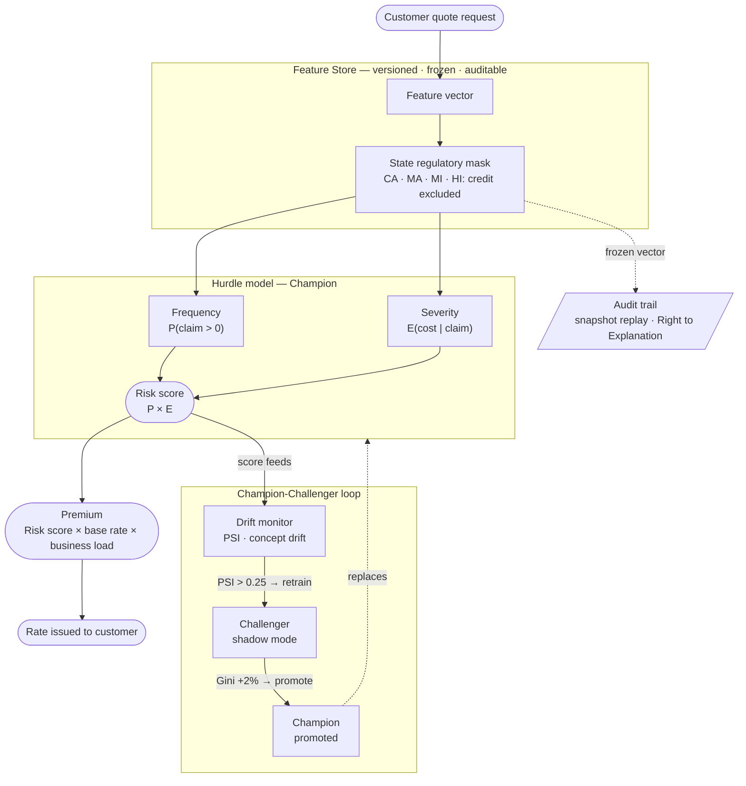

## Risk scoring model

```mermaid
flowchart TD
    Q(["Customer quote request"])

    subgraph FS["Feature Store  —  versioned · frozen · auditable"]
        direction LR
        FV["Feature vector"]
        MASK["State regulatory mask\nCA · MA · MI · HI: credit excluded"]
        FV --> MASK
    end

    subgraph MODEL["Hurdle model  —  Champion"]
        direction LR
        M1["Frequency\nP(claim > 0)"]
        M2["Severity\nE(cost | claim)"]
        RS(["Risk score\nP × E"])
        M1 & M2 --> RS
    end

    subgraph CC["Champion-Challenger loop"]
        direction LR
        DRIFT["Drift monitor\nPSI · concept drift"]
        CHAL["Challenger\nshadow mode"]
        CHAMP["Champion\npromoted"]
        DRIFT -->|"PSI > 0.25 → retrain"| CHAL
        CHAL -->|"Gini +2% → promote"| CHAMP
    end

    PREM(["Premium\nRisk score × base rate × business load"])
    OUT(["Rate issued to customer"])
    AUD[/"Audit trail\nsnapshot replay · Right to Explanation"/]

    Q --> FV
    MASK --> M1 & M2
    RS --> PREM
    RS -->|"score feeds"| DRIFT
    CHAMP -.->|"replaces"| MODEL
    PREM --> OUT
    MASK -.->|"frozen vector"| AUD
```
